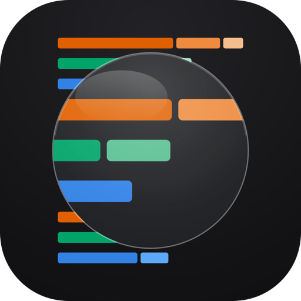
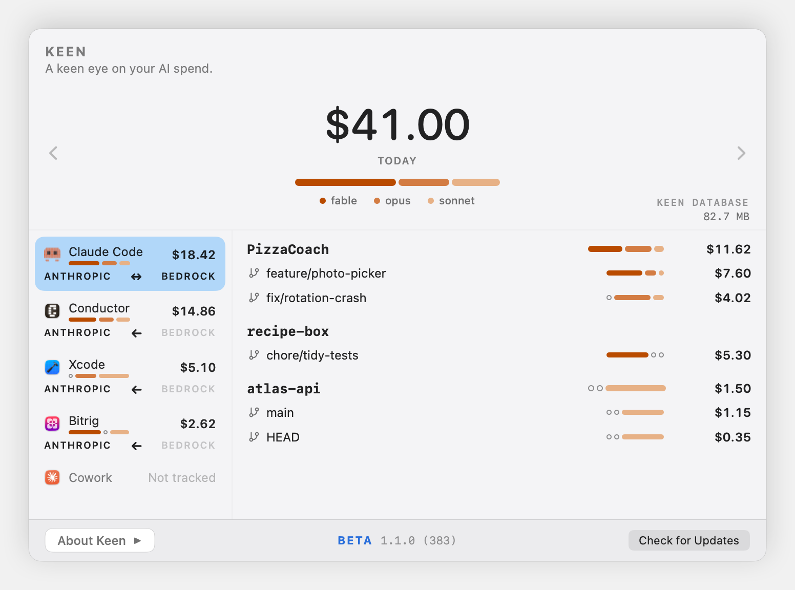
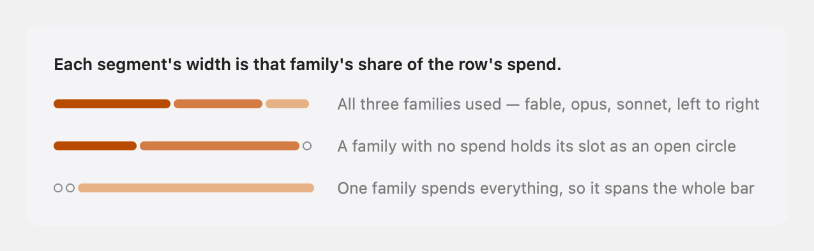
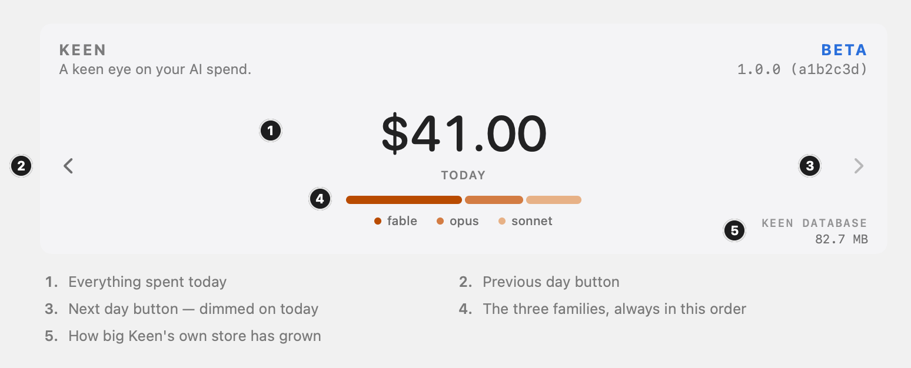
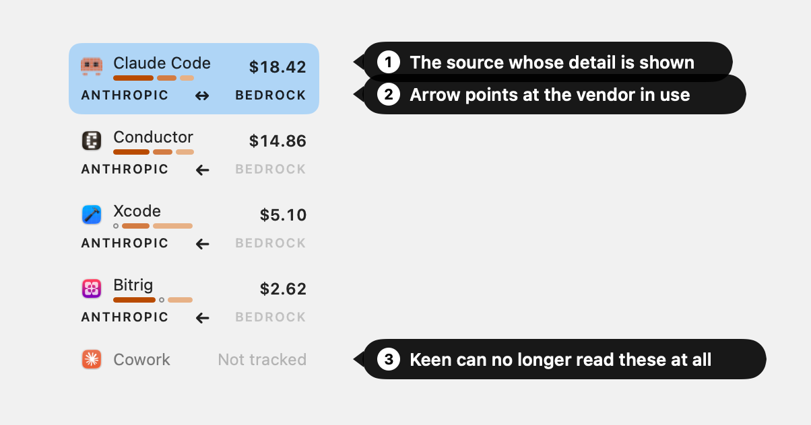
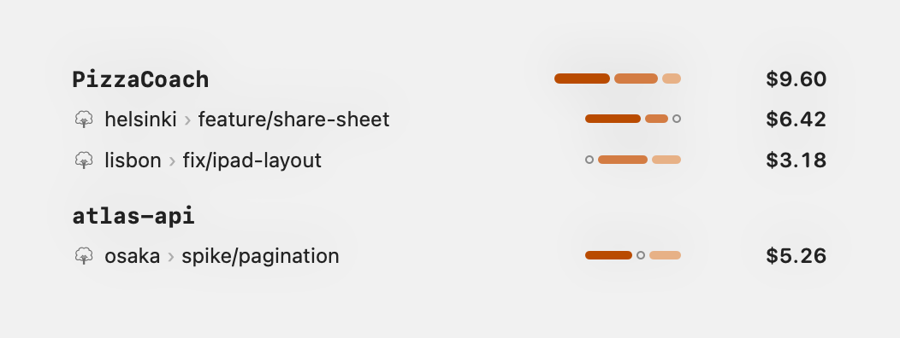
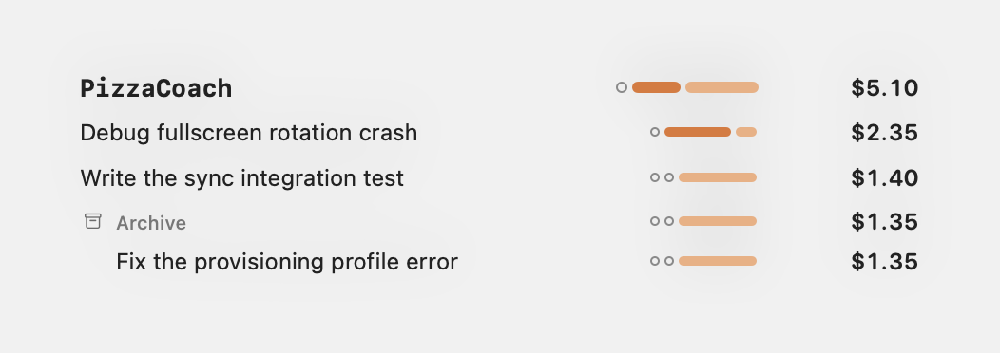
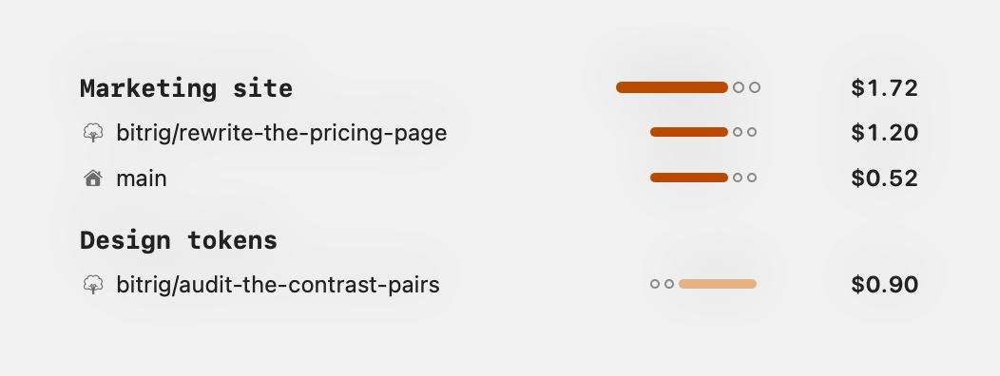

  

<h1 align="center">Keen</h1>

A keen eye on your AI spend.

<strong>Beta.</strong> Version 1.0.0 is the first public build.

---

Keen is a macOS menu bar app that shows what your AI coding work costs. It reads the
transcript files that Claude Code, Conductor, Xcode, and Bitrig already write to your
Mac, prices every turn against published rates, and puts a running total in your menu
bar. It sends nothing anywhere — the only things it talks to are its own update feed,
once a day, and the download of an update you choose to install.

> [!IMPORTANT]
> Keen prices your usage at published API rates. On a Max or Pro plan that number is the
> **retail value of what you used, not what you were billed** — usually far more than you
> actually pay. [How the numbers work](#how-the-numbers-work) explains the rest.

  

Every screenshot on this page is rendered from the real interface with made-up
projects and amounts, so none of them shows anyone's actual work.

## How to read it

Three conventions are worth knowing before the rest makes sense.

### The model-mix marker

This little bar shows up throughout Keen — in the header, on every source, on every row.
It splits that row's spend across Fable, Opus, and Sonnet, left to right, darkest to
lightest, each segment as wide as its share. A family you didn't use collapses to an open
circle that holds its place, so the bar always has the same three slots in the same
order.

### The header

The big number is everything you spent that day, across every source and both vendors.
The chevrons step back and forward a day; forward stops at today. The tier key under the
marker always shows all three model families at full strength, whether or not you used
them — it is a legend, not a reading.

### The source rail

Each source shows its own total and mix. The arrow between ANTHROPIC and BEDROCK points
at the vendor that ran the work — left for Anthropic, right for Bedrock, both ways if you
used each. The dimmed label is the one you didn't use.

*No Spend* and *Not tracked* mean different things. *No Spend* is a source Keen watches
that had nothing today. *Not tracked* is a source Keen cannot read at all.

### The footer

The strip along the bottom holds the version you're running and two controls.
**Check for Updates** on the right does the check immediately, and **About Keen** on the
left opens a panel inside the popover — the version and copyright, a link to this page,
a link to file an issue, the third-party notices, and the switch for whether Keen checks
for updates on its own.

## What it reads

Keen only reads files that already exist on your Mac. It never asks for an API key and
never contacts a server. Work billed through Amazon Bedrock is counted alongside
Anthropic, and each row shows which of the two it ran on.

Each source is broken down the way that tool organizes work.

### [Claude Code](https://claude.com/product/claude-code)

One row per branch that had work in it, grouped under its repository. A session that ran
detached shows as `HEAD`. That is what the screenshot above shows.

### [Conductor](https://conductor.build)

One section per project, one row per workspace. Each workspace is an isolated git
worktree with its own branch.

### [Xcode](https://developer.apple.com/xcode/)

Chats, not branches. One row per assistant chat, under the project it ran in.

### [Bitrig](https://bitrig.com)

One section per project, one row per workspace, named for its branch. A house marks
the project's main workspace; a tree marks each branch workspace.

If Keen isn't picking up sessions you expect to see, please
[open an issue](../../issues). That is useful to know.

## What it doesn't track

Keen reads local files. Anything that does not leave a transcript on your Mac is
invisible to it.

### [Cowork](https://www.anthropic.com/product/claude-cowork) is not tracked

Keen cannot currently track Cowork. It shows *Not tracked* rather than $0.00, and
anything it recorded earlier still counts.

### Nothing on the web is tracked

Conversations on claude.ai, chats in the Claude desktop app, Claude Code on the web, and
Cowork cloud sessions all run on Anthropic's servers. No token counts reach your Mac, so
Keen has nothing to read.

### Haiku is skipped on purpose

It is cheap enough that counting it would not change the picture, so Keen leaves it out
of both the totals and the model mix. The three families it tracks are Fable, Opus, and
Sonnet.

## Privacy

Everything stays on your Mac.

### The only thing it sends is an update check

Keen makes exactly two kinds of network request, both of them about updating itself:

- Once a day it fetches `https://flowmada.github.io/keen-app/appcast.xml` — a small
  file listing the current version and what changed in it. The request carries nothing
  but the version of Keen you're running, which is unavoidable in an HTTP request. You
  can switch this off in **About Keen**, in the popover's footer.
- When you choose to install an update, it downloads that release's zip from this
  repository's releases page.

That's the whole list. **No transcript, session, project, branch or spend data ever
leaves your Mac**, and Keen does not send a system profile — not your Mac model, not your
macOS version, nothing about your hardware. There is no analytics, no crash reporting and
no account.

Updates are handled by [Sparkle](https://sparkle-project.org), the standard macOS update
framework, over HTTPS. Every download must carry a valid signature from a key only the
developer holds, or Keen refuses to install it.

Keen's other third-party dependency is
[GRDB.swift](https://github.com/groue/GRDB.swift), a SQLite wrapper, which makes no
network requests of its own.

### What it stores

Keen keeps one SQLite database at
`~/Library/Application Support/Keen/tokens.sqlite`, with periodic copies in a `backups`
folder beside it. It holds, per turn: a timestamp, token counts, the model name, the
computed cost, the working directory, the git branch and repository, which tool it came
from, and which session it belonged to. It also stores **session titles** — the short
descriptions Claude Code generates for a conversation, such as *"Check minimum macOS
version requirement."* The popover shows you the database's current size.

### What it does not store

Keen does not copy your prompts, the assistant's replies, or any file contents out of the
transcripts. It reads those files, extracts the accounting fields, and keeps only those.

Deleting `~/Library/Application Support/Keen/` removes everything Keen has ever
recorded. The original transcripts belong to the tools that wrote them and are untouched.

## How the numbers work

Keen counts the tokens in each turn — input, output, cache writes, and cache reads,
each at its own rate — and multiplies by the published price for that model. The rate
card is a JSON file compiled into the app. It currently prices eleven models across
Anthropic and Amazon Bedrock: Fable 5 and 5.1, Opus 4.5 through 5.5, and Sonnet 4.5
through 5. It also carries a rate for Haiku, which it prices but leaves out of the
totals — see [Haiku is skipped on purpose](#haiku-is-skipped-on-purpose).

The three-segment bar under the total shows the mix across Fable, Opus, and Sonnet, with
each segment's width proportional to its share of spend. An unused tier holds its place
as an open circle so the bar stays readable at a glance.

Two things are worth understanding about what the number means.

### On a subscription, it is retail value, not a bill

Keen prices every turn the same way, whether you paid per token or used a Max or Pro
plan. If you are on a subscription, the figure is what that usage would have cost at API
rates — it is not what you were charged, and it will usually be much larger than what you
pay. Internally Keen keeps these separate as *spent* versus *value*; the current popover
blends them into one headline number for simplicity.

### Rates are baked into the build

If Anthropic changes a price, Keen keeps using the old one until a new release ships with
an updated card. A pricing feed that could update rates without a new build is under
consideration.

## Install

Keen requires **macOS 13 or later**. It is beta software, so treat its numbers as
estimates to check rather than as a bill.

1. Download `Keen-<version>.zip` from the [latest release](../../releases/latest). Ignore
   the "Source code" archives GitHub attaches automatically — this repository holds no
   source code.
2. Unzip it. You will get `Keen.app`.
3. Drag `Keen.app` to your Applications folder and open it.

The app is signed with a Developer ID certificate and notarized by Apple, so it opens
without a Gatekeeper warning.

On first launch Keen backfills every transcript it can find. Depending on how much
history you have, this can take several minutes and will use noticeable CPU while it
runs. It only happens once; after that it watches for new turns and updates as you work.

## Updating

Keen updates itself. It checks once a day, and when a new version is available it asks
before downloading anything — nothing installs behind your back.

You can also check whenever you like: open the popover and click **Check for Updates** in
the footer, or right-click (or ⌃-click) the Keen icon in your menu bar and choose **Check
for Updates…**.

You can turn the daily check off. **About Keen** in the popover's footer has
*Automatically check for updates*; uncheck it and Keen makes no network request at all
until you ask it to.

If you'd rather hear about releases another way, use **Watch → Custom → Releases** at the
top of this page and GitHub will notify you when one ships.

## Feedback

Bugs and suggestions go in [Issues](../../issues). If a number looks wrong, the most
useful thing you can include is which source and which model it involved.

## License

Keen is free to use. See [LICENSE](LICENSE) for the terms, and
[THIRD-PARTY-NOTICES.md](THIRD-PARTY-NOTICES.md) for the open-source components it
includes.

## Trademarks

Claude, Claude Code, and Cowork are trademarks of Anthropic, PBC. Amazon Bedrock is a
trademark of Amazon.com, Inc. Xcode and macOS are trademarks of Apple Inc. Conductor is
a trademark of Melty Labs, Inc. Bitrig is a trademark of Bitrig, Inc. Other names are
trademarks of their respective owners.

Keen is an independent app. It is not affiliated with, endorsed by, or sponsored by any
of these companies.
